# Lab 01: Getting Started with Building a Chat Application

## Overview

In this lab, you will learn how to build a chat application using Microsoft Foundry portal. The lab involves setting up the necessary OpenAI resources and deploying a ChatGPT-like application using Streamlit. By the end of this lab, you will have a fully functional application that can interact with users through a simple web interface.

## Exercise 1: Open AI Setup and Installation of Applications

In this exercise, you will see how the Foundry resource is set up and then install the necessary applications locally. This exercise is divided into two tasks: setting up the OpenAI resource (read-only) and building a ChatGPT-like application.

### Task 1: Create an OpenAI resource and model **(Read-Only)**

 > **Note:** This task is **READ-ONLY**. The OpenAI setup is already configured for your environment.

In this task, you will review the setup of the Foundry resource, which has already been configured for your environment. This task is read-only, meaning no changes will be made.

1. In the Azure portal, search for **Foundry** **(1)** in the top search box, then select **Microsoft Foundry** **(2)** under Services.

   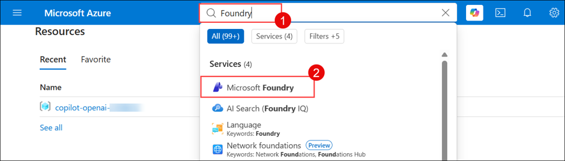
   
1. From the side pane, expand **use with foundry (1)**, click on **Foundry (2)**, select **Create (3)**.

   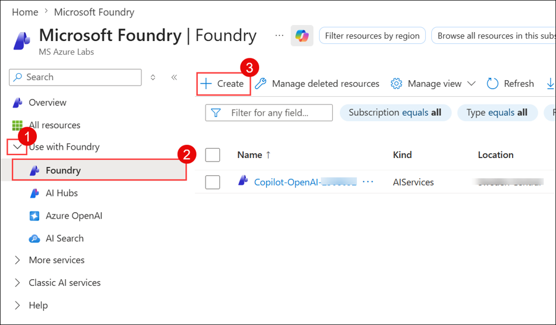
   
1. In the **Create a Foundry resource** pane under the **Instance Details** tab, select the **default subscription (1)** and select the existing **copilot-openai-<inject key="Deployment ID" enableCopy="false"/> (2)** resource group. Select **East US (3)** as Region, enter Name as **copilot-openai-<inject key="Deployment ID" enableCopy="false"/>(4)** and project name to be **odl-<inject key="Deployment ID" enableCopy="false"/>-proj (5)**. Click on **Review + Create (6)**.

   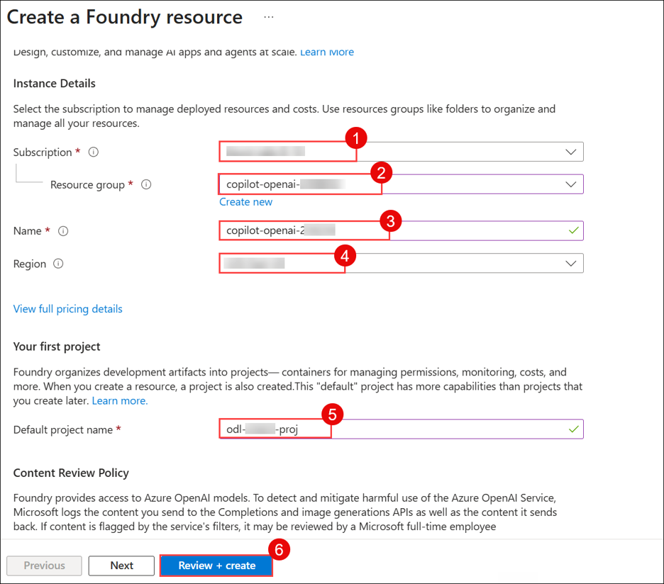

1. Verify that validation has passed in the **Review + Create** pane, and then click on **Create**.

   > **Note:** This task is **READ-ONLY**. The OpenAI setup is already configured for your environment. Please **DO NOT** click on **Create**. 

   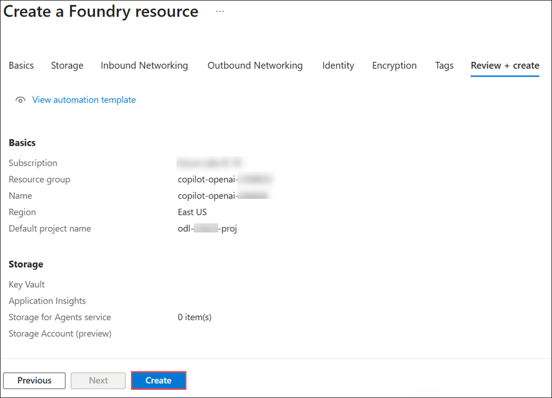
   
1. In the Microsoft Foundry resource pane, select **Go to Foundry portal**.

   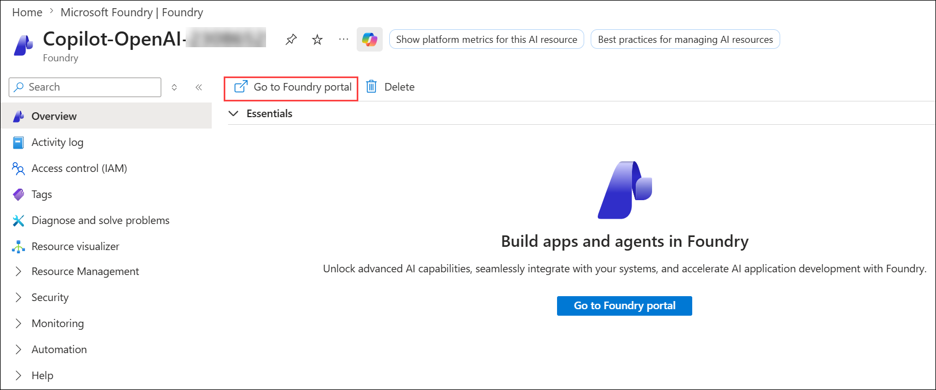

   >**Note:** You will be working in the new Foundry experience and will explore and work with the latest interface.

1. The Environment would already have a project **pre-setup**, you can proceed to navigate to the existing one by clicking on it.

   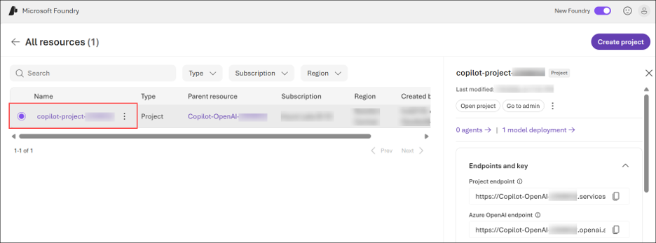
   
1. In the Foundry portal, click **Build (1)**, click **Deployments (2)** and select **Deploy (3) base model (4)**.

   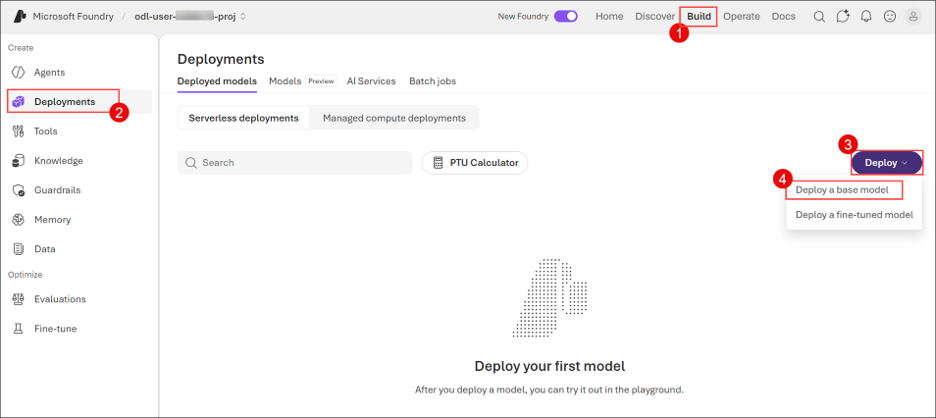

   >Note: You will see models are already configured but the idea is to show how models are deployed within Foundry

1. On the **Explore models** tab, search for `gpt-5.4` (1) and select the respective model (2).

   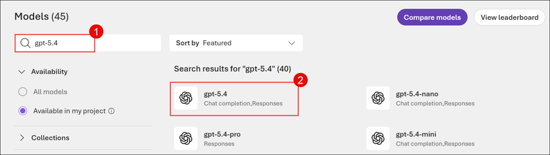
   
1. You can then proceed to customize the model's configuration by clicking **Deploy (1)** and choosing **Custom Settings (2)**.

   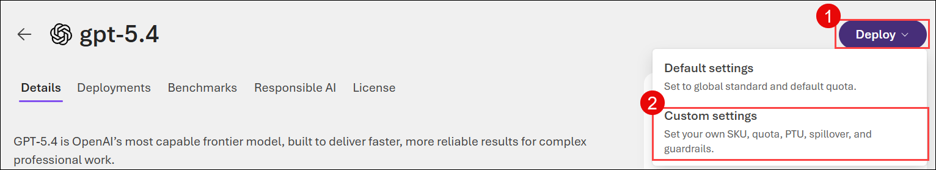

1. Cross verify the details and proceed to **Deploy (4)**.

   - Deployment name: **gpt-5.4 (1)**
   - Deployment type: **Global Standard (2)**
   - Tokens per Minute Rate Limit (thousands): **15K (3)**

     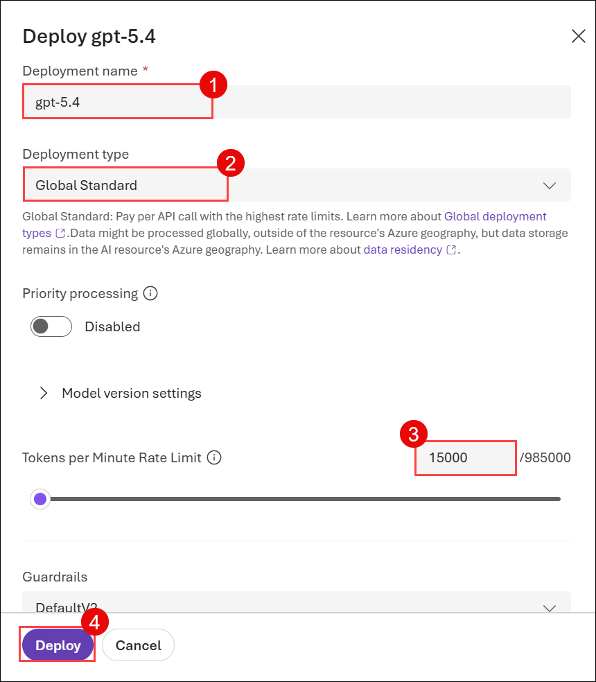

     > **Note:** This task is **READ-ONLY**. The model is already configured for your environment. Please **DO NOT** click on **Deploy**. 
   
### Task 2: Building a ChatGPT-like application on Streamlit with streaming

In this task, you will configure a locally hosted application that mimics the functionality of ChatGPT. This will involve setting up necessary files, configuring secrets, and running the application. 

1. In the Azure portal, search for **Foundry** **(1)** in the top search box, then select **Microsoft Foundry** **(2)** under Services.

   

1. From the side pane, expand **use with foundry (1)**, click on **Foundry (2)**, select the existing **Foundry resource (3)**.

   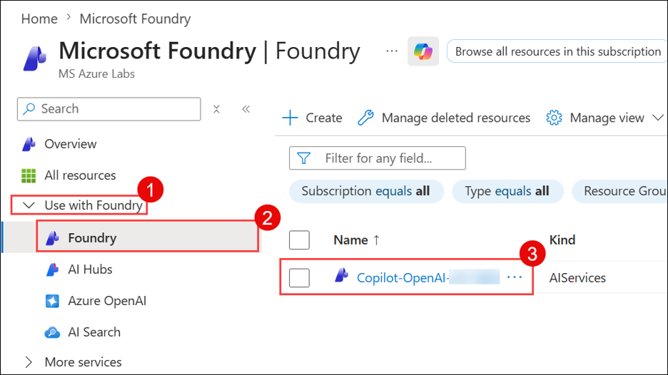

1. In the Foundry resource pane, select **Go to Foundry portal**.

   
      
1. In the **Microsoft Foundry** portal, select **Build (1)** on the top bar and click **Deployments (2)** and verify that the **gpt-5.4 (3)** model is present.
   
   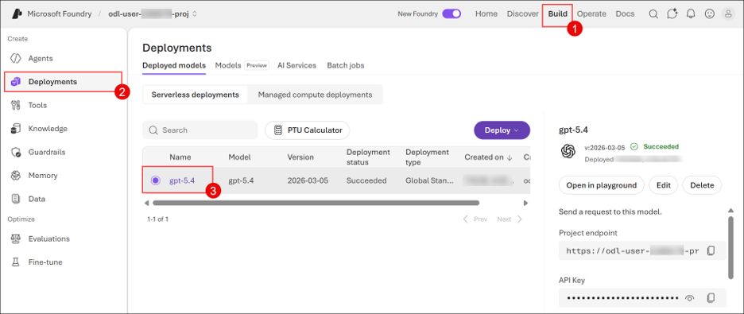

1. Navigate back to the **Home tab (1)** on the **Foundry resource**, copy the **API Key (2)** and **Azure OpenAI Endpoint (3)**, and store them in a text file for later use.

   
   
1. On the LabVM you are working on, open File Explorer. In the folder/location field (URL/path), you can paste the full file path directly, then navigate to

   ```
   C:\LabFiles\OpenAIWorkshop\scenarios\incubations\copilot\ChatGPT
   ```

   

1. Right-click on the `secrets.env` file, and select **Open with Code**.

    

1. In the `secrets.env` file, replace the following values with the ones you copied earlier. Press **CTRL+S** to save the file.

    - **AZURE_OPENAI_API_KEY**: Replace with your Azure OpenAI Key
    - **AZURE_OPENAI_CHAT_DEPLOYMENT**: Replace with `gpt-5.4`
    - **AZURE_OPENAI_ENDPOINT**: Replace with your Azure OpenAI **Endpoint**

      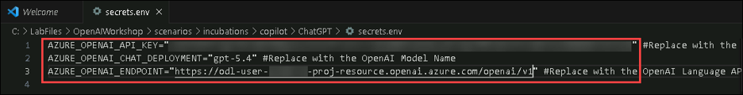

1. Navigate back to File Explorer and open `chatgpt.py` with **Visual Studio Code** to view the code to build a ChatGPT-like app.

    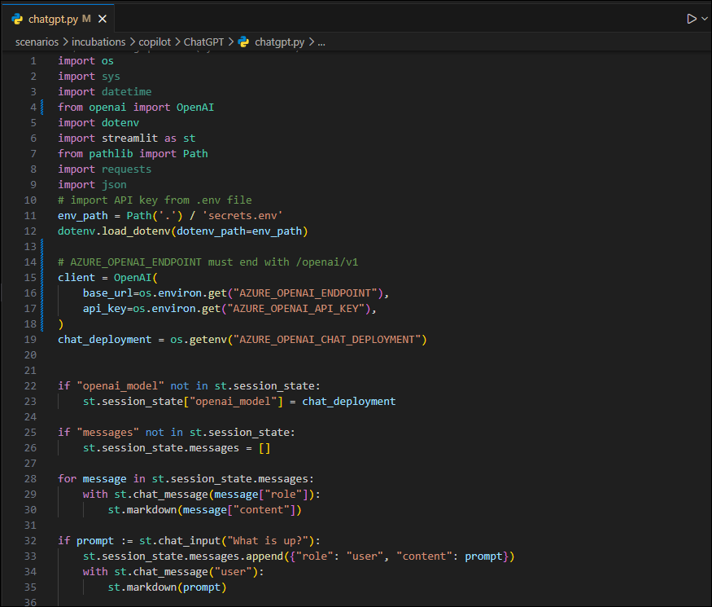 

    >**Tip:** **Streamlit** is an open-source Python framework that enables rapid development of interactive web apps for data science and machine learning projects. It allows developers to create user-friendly dashboards and visualizations with minimal coding.
 
1. Next, click on the **Eclipse Button (1)** on the top, then select **Terminal (2)** and click on **New Terminal (3)**.

    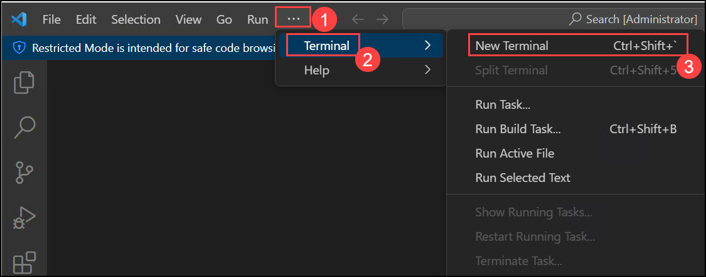 

1. Verify or run the following command in the terminal to change the directory if you are not already in the correct location.

   ```
   cd C:\LabFiles\OpenAIWorkshop\scenarios\incubations\copilot\ChatGPT
   ```
   
1. To execute the application, run the following command.

   > **Note**: You can enter your email address below to get notifications. If not, please leave this field blank and click on **Enter**.

   ```
   streamlit run chatgpt.py
   ```
   
1. Once the execution of `streamlit run chatgpt.py` is completed, a locally hosted demo application will be opened in the web browser.

   
   
   

1. Explore the app by running a few queries. Congratulations! You've built your own ChatGPT-like app in 50 lines of code.

   

1. Congratulations! You have successfully built your own ChatGPT-like application using Streamlit.

#### Validation

<validation step="21770280-2848-4d6f-ad32-f3bda8d83cc9" />

## Summary

In this lab, you have accomplished the following:

- You reviewed the setup of the Foundry resource, which was pre-configured for your environment.
- You configured and deployed a ChatGPT-like application using Streamlit.
- You successfully hosted the application locally and tested its functionality by running queries.
