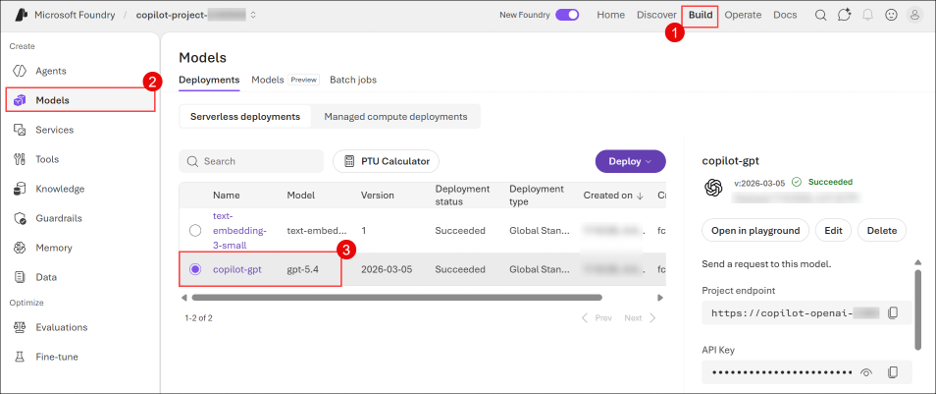
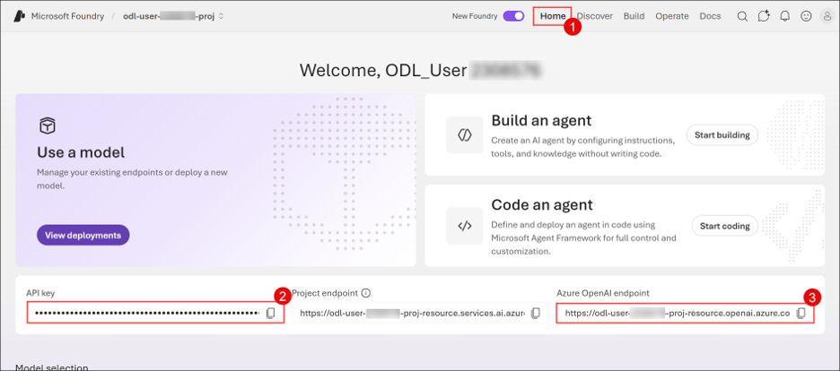
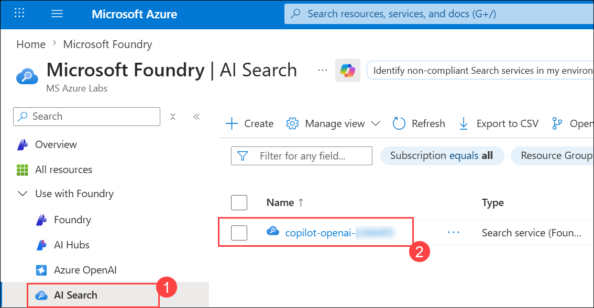
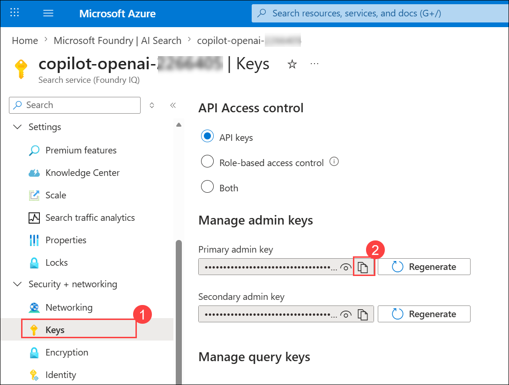
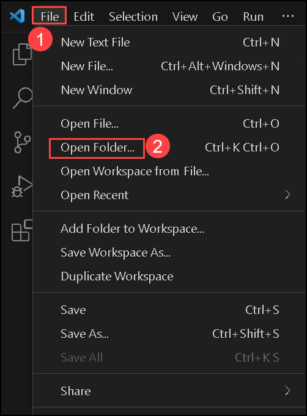
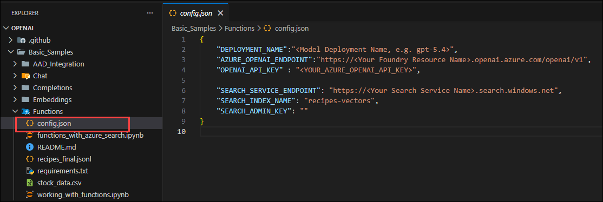
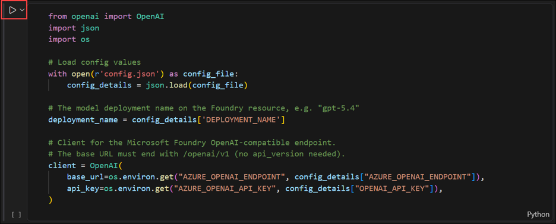

# Lab 02: Understand Function Calling in OpenAI GPT

## Overview

This lab focuses on the Function Calling feature in Azure OpenAI, an advanced capability that enables modern lifecycle-supported models such as the GPT-5 series to generate structured JSON outputs mapped to predefined functions. Unlike legacy GPT-3 and earlier GPT-4 models, current Azure OpenAI deployments are built around forward-compatible model versions designed for enterprise-grade scalability and long-term support.

By integrating these models with external systems, you can gain enhanced control, reliability, and flexibility in automation and data processing tasks. Function calling allows the model to intelligently determine when to invoke backend services and provide validated arguments for execution, enabling seamless integration with APIs, databases, and business workflows.

Throughout this lab, you will explore the setup, configuration, and practical implementation of function calling within the Azure OpenAI environment, empowering you to design structured, production-ready AI applications aligned with Microsoft’s current model lifecycle strategy.

To learn more about Azure function calling, please refer to [Function calling in Azure OpenAI Service](https://learn.microsoft.com/azure/ai-services/openai/how-to/function-calling).

## Task 1: Understand Function calling

In this task, you will explore how to set up and configure the Azure OpenAI environment to leverage function calling. You will gather necessary information such as deployment names, API keys, and service endpoints, and configure them in a sample project. Finally, you will run a Jupyter Notebook to observe how function calling works in action.

1. In the Azure portal, search for **Foundry** **(1)** in the top search box, then select **Microsoft Foundry** **(2)** under Services.

   

1. From the side pane, expand **use with foundry (1)**, click on **Foundry (2)**, select the existing **Foundry resource Copilot-OpenAI-<inject key="Deployment ID" enableCopy="false"/>(3)**.

   

1. In the Foundry resource pane, select **Go to Foundry portal**.

   
      
1. In the **Microsoft Foundry** portal, select **Build (1)** on the top bar and click **Models (2)** and verify that the **copilot-gpt (3)** model is present, as well as the text embedding model, both of which are pre-deployed for this lab.
   
   

1. Make sure to copy the deployment name, API key, and endpoint of the model and save them in your editor.

1. Navigate back to the **Home tab (1)** on the **Foundry resource**, copy the **API Key (2)** and **Azure OpenAI Endpoint (3)**, and store them in a text file for later use.

   
   
1. Navigate back to the **Azure portal**, then locate and select **AI Search (1)** from the left menu, and click on **copilot-openai-<inject key="Deployment ID" enableCopy="false"/> (2)**.

   

1. From the Overview tab of Cognitive Search, copy the **URL** and paste it into a text editor for later use.

   

1. From the left menu, select **Keys (1)** under security + networking, copy the **Primary admin key (2)**, and paste it into a text editor for later use.

   

1. Open **Visual Studio Code** from the desktop. Then select **File (1)** and click **Open Folder (2)**.

     

1. Navigate to the below-mentioned path and click on **Select folder**. 

    ```
    C:\LabFiles\openai\Basic_Samples\Functions
    ```

1. On the **Do you trust the authors of the files in this folder?** pop-up check the box next to **Trust the authors of all files in the parent folder 'Basic_Samples'**, and select **Yes, I trust the authors**.

     

1. In the **Functions** folder, open `config.json` and replace the following values with the ones you copied earlier. Next, press **CTRL + S** to save the file.

    - **DEPLOYMENT_NAME**: `Replace the value with the gpt-model name as ` **copilot-gpt** 
    - **OPENAI_API_ENDPOINT**: `Replace the value with Azure OpenAI Endpoint`
    - **OPENAI_API_KEY**: `Replace the value with Azure OpenAI Key`
    - **SEARCH_SERVICE_ENDPOINT**: `Replace the value with the Search Service Endpoint`
    - **SEARCH_ADMIN_KEY**: `Replace the value with the Search Service key`

   
   
1. Next, click on the **Eclipse Button (1)** on the top, then select **Terminal (2)** and click on **New Terminal (3)**.

     

1. In the new terminal, run the following command to install the required modules:

    ```
    pip install -r requirements.txt
    ```
    
1. Once the requirements are installed, close the terminal.

1. Open the `working_with_functions.ipynb` file from the left menu.

     

1. Click on the **Run (1)** button in the first cell. Once the pop-up `Install/Enable suggested extensions Python + Jupyter` (2)  appears, click on it to install the Python and Jupyter extensions. 

     

1. Next, on the **Choose a Kernel source** pop-up, select **Python Environments**. This will initiate the installation of the extension.

       

1. Next, on the **Select a Python Environment** pop-up, select **Python 3.10.0**. This will set the Python Environment. 

       

   > **Note**: If prompted with **Running cells with 'c:\python311\python.exe' requires the ipykernel package.** then click on **Install**.

      

1. Execute the notebook cell by cell (using either `Ctrl + Enter` to stay on the same cell or `Shift + Enter` to advance to the next cell) and observe the results of each cell execution.

      

   > **Note:** Please ensure to run the notebook end to end and observe the output for each cell. 

#### Validation

<validation step="2945e6ae-9193-4560-b2b6-9b42f8bc7917" />

## Summary

In this lab, you have accomplished the following:

- You have learned how to configure and set up the Microsoft Foundry environment for function calls.
- You explored gathering and configuring essential details like deployment names, API keys, and service endpoints.
- You observed the function calling process through the execution of a Jupyter Notebook in Visual Studio Code.
