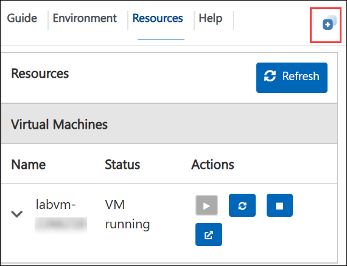
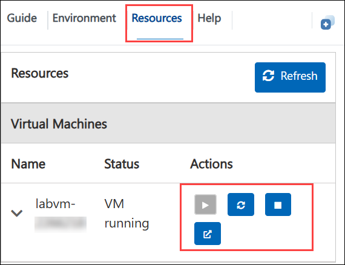

# Understand function calling in Open AI GPT

### Overall Estimated Duration: 30 Minutes

## Overview

In this hands-on lab, you will provision an Azure OpenAI resource in Azure AI Foundry and install the application locally. Modern Azure OpenAI deployments now focus on lifecycle-supported models such as GPT-4.1, GPT-4.1-mini, and the GPT-5 family, replacing legacy GPT-3 and earlier GPT-4 variants. This ensures your solution aligns with Microsoft’s current model lifecycle and long-term upgrade strategy.

A key capability you will explore is Function Calling, which enables GPT-4.1 and GPT-5-class models to generate structured JSON outputs mapped to predefined functions. Instead of returning only natural language responses, the model can determine when to invoke external tools and provide validated arguments for execution. This structured integration allows developers to connect AI models with APIs, databases, and enterprise systems, enabling scalable and production-ready AI applications.

Additionally, you will work with a Python-based Smart_Agent object that defines goals and tasks, handles natural language interactions, manages tool execution, and maintains conversation memory. You will also explore how this capability integrates into a multi-agent copilot architecture, where specialist agents are coordinated by an agent runner to ensure efficient task delegation and continuity across domains.

## Objective

In this lab, you will learn how to deploy lifecycle-supported Azure OpenAI models, configure them securely, and implement function calling within a multi-agent copilot architecture.

By the end of this lab, you will be able to:

- **Understand function calling in Azure OpenAI models:** Gain a clear understanding of how structured outputs are generated, how functions are defined, and how parameters and return values are used to integrate AI models with external systems.

## Pre-requisites

Participants should have:

- **Familiarity with Modern GPT Models:** Understanding of GPT-4.1 class or GPT-5 class models and their enterprise capabilities within Azure OpenAI.

- **Experience with REST APIs:** Familiarity with REST APIs, as function calling involves interacting with external services.

- **Basic Programming Skills:** Proficiency in Python programming to follow along with the Smart_Agent object setup and multi-agent copilot model implementation.

- **Basic Azure Knowledge:** Familiarity with Azure Portal and resource deployment concepts.

## Architecture

In this hands-on lab, the architecture flow includes several essential components. You’ll begin by provisioning the Azure OpenAI resource in Azure AI Foundry and installing the required application locally. At the core of the architecture is the Azure OpenAI Service, which utilizes GPT-4.1 or GPT-5 family models with function calling capabilities to generate structured JSON outputs from predefined functions. These structured outputs enable seamless integration with various systems, APIs, and backend tools.

The Smart_Agent Python object plays a crucial role, handling tasks such as goal definition, natural language processing (NLP) interactions, tool execution, and conversation memory management, while securely connecting to the deployed Azure OpenAI model. Additionally, the system uses a multi-agent copilot architecture, where a specialized agent runner manages and coordinates tasks among multiple domain-specific agents, ensuring efficient task orchestration and contextual continuity across diverse domains.

## Architecture Diagram

## Explanation of Components

The architecture for this lab involves the following key components:

- **Azure OpenAI:** Azure OpenAI Service provides REST API access to OpenAI's powerful language models, and these models integrates with your data, enabling customized and secure interactions.

- **Azure OpenAI Models:** Offers pre-trained and customizable large language models for various AI applications. These models allow for powerful AI-driven solutions by generating tailored and contextually relevant content based on well-crafted prompts.

## Getting Started with the Lab

After the environment has been set up, your browser will load a virtual machine (JumpVM) and the lab manual. Use this virtual machine throughout the workshop to perform the lab. You can see the number on the bottom of the lab guide to switch to different exercises in the lab guide.

 
 
## Exploring Your Lab Resources
 
To get a better understanding of your lab resources and credentials, navigate to the **Environment** tab.
 
   
 
## Utilizing the Split Window Feature
 
For convenience, you can open the lab guide in a separate window by selecting the **Split Window** button from the Top right corner.
 
 

 ## Lab Guide Zoom In/Zoom Out
 
To adjust the zoom level for the environment page, click the **A↕ : 100%** icon located next to the timer in the lab environment.

 
 
## Managing Your Virtual Machine
 
Feel free to start, stop, or restart your virtual machine as needed from the **Resources** tab. Your experience is in your hands!
 
 
 
## Login to the Azure Portal

1. In the JumpVM, click the Azure Portal shortcut in Microsoft Edge, which is created on the desktop.

   
   
2. On the **Sign in to Microsoft Azure** tab, you will see the login screen. Enter the following email or username, and click on **Next**. 

   * **Email/Username**: <inject key="AzureAdUserEmail"></inject>
   
      
     
3. Now enter the following Temporary Access Pass, and click on **Sign in**.
   
   * **Temporary Access Pass**: <inject key="AzureAdUserPassword"></inject>
   
      
     
4. If you see the pop-up **Stay Signed in?**, select **No**.

      

5. If a **Welcome to Microsoft Azure** popup window appears, select **Maybe Later** to skip the tour.
   
6. Now that you will see the Azure Portal Dashboard, click on **Resource groups** from the Navigate panel to see the resource groups.

   

7. Click "Next" from the bottom right corner to embark on your Lab journey!

     

### Support Contact
The CloudLabs support team is available 24/7, 365 days a year, via email and live chat to ensure seamless assistance at any time. We offer dedicated support channels tailored specifically for both learners and instructors, ensuring that all your needs are promptly and efficiently addressed.
 
Learner Support Contacts:
 
- Email Support: cloudlabs-support@spektrasystems.com
- Live Chat Support: https://cloudlabs.ai/labs-support
 
### Happy learning !

